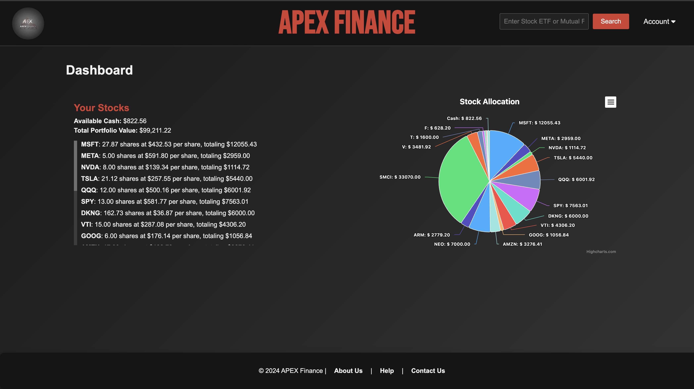
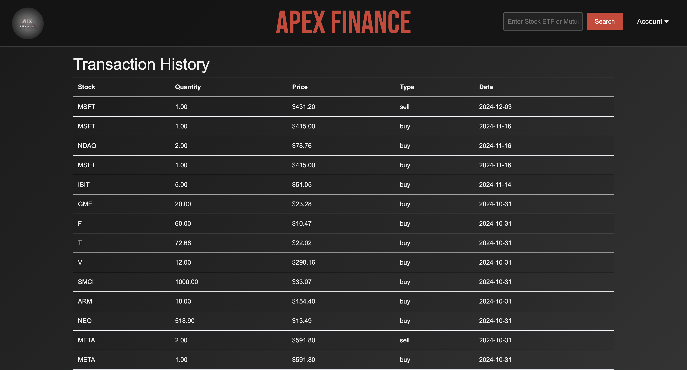
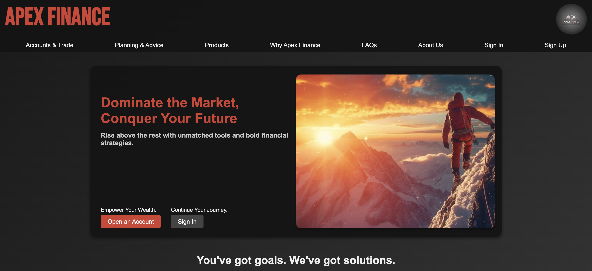

# ApexFinance-Django

ApexFinance is a Django-based stock and finance web application designed to provide users with real-time market data, portfolio tracking, and interactive dashboards. The project aims to offer a professional platform for both individual investors and finance enthusiasts to monitor and manage their investments efficiently.

---

## Features

- **Real-Time Stock Quotes** – Fetches up-to-date stock prices and key financial metrics using Yahoo Finance API.
- **Portfolio Management** – Track personal holdings and calculate total portfolio value dynamically.
- **Historical Data Visualization** – View historical stock prices with customizable periods and intervals.
- **Interactive Dashboards** – Graphical visualizations for stocks, ETFs, and user portfolios.
- **User Authentication** – Secure login required for accessing sensitive portfolio data.
- **Extra Charts** – Additional charts for related stocks or ETFs to aid in decision-making.

---

## Screenshots

### Dashboard


### Portfolio History


### Main Page



---

## Setup Instructions

Follow these steps to get ApexFinance-Django running locally:

1. **Clone the repository:**
```bash
   git clone <repository-url>
   cd ApexFinance-Django
```

2. **Create and activate a virtual environment:**
```bash
   python3 -m venv venv
   source venv/bin/activate   # On Windows: venv\Scripts\activate
```

3. **Install dependencies:**
```bash
   pip install -r requirements.txt
```

4. **Apply migrations and create a superuser:**
```bash
   python manage.py migrate
   python manage.py createsuperuser
```

5. **Run the development server:**
```bash
   python manage.py runserver
```

6. **Access the application:**
   - Open your browser and go to `http://127.0.0.1:8000/`
   - The Django admin portal is available at `http://127.0.0.1:8000/admin/`

---

## Dependencies

- Django 5.1.1
- yfinance
- Other dependencies listed in `requirements.txt`

---

## Project Structure
```
ApexFinance-Django/
├── ApexFinance/           # Main Django project
├── dashboard/             # Dashboard app
├── search/                # Stock search and quotes
├── users/                 # User authentication and profiles
├── transactionHistory/    # Portfolio transactions
├── home/                  # Landing pages and general views
├── settings/              # Application settings management
├── screenshots/           # UI screenshots
├── requirements.txt       # Python dependencies
└── supervisord.conf       # Deployment configuration
```

---

## Notes

- Ensure you have an active internet connection for real-time stock data.
- Yahoo Finance API limits requests; excessive requests may return errors.
- Recommended to run the app in a virtual environment to manage dependencies safely.

---

## License

This project is open-source. Please refer to the repository for license details.

---

## Authors

**Daniel Chavez**  
Finance and Software Developer | ApexFinance Project Lead

**Anthony Petrosino**
Backend Software Engineer

> **Archive Notice:** This project is no longer actively maintained as of November 2025. It remains available as a portfolio demonstration and reference implementation. Thank You for viewing.